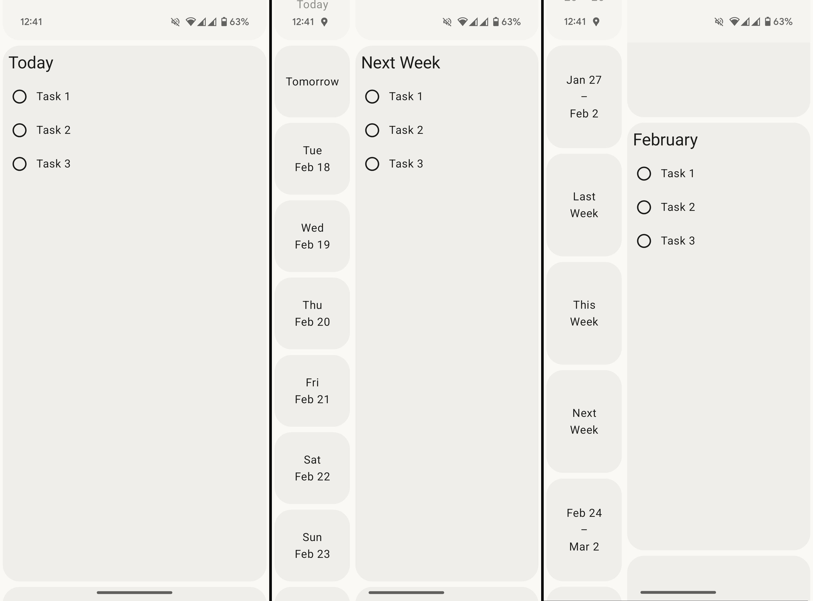

# ToDue (Android)

A hybrid between todo list and calendar that helps you to plan your days and keep an overview over
your tasks.

## About

Currently, this project serves as an exploration of Android development with Jetpack Compose and
its capabilities for building non-standard UIs.
